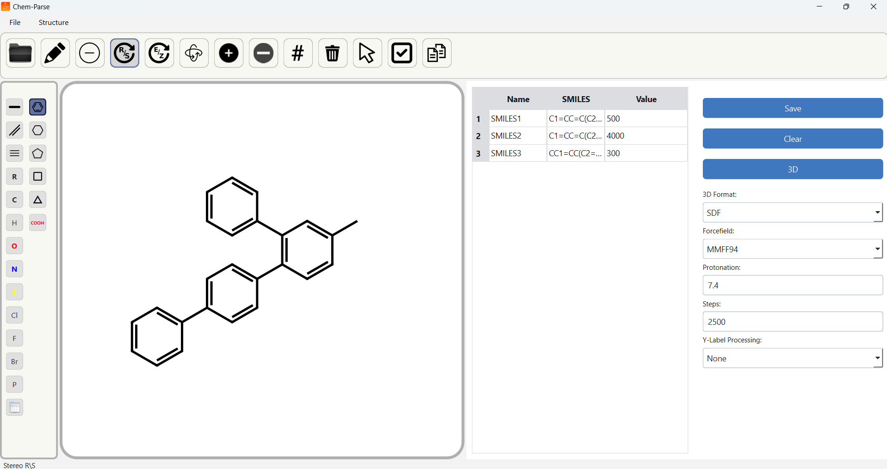

<h1 style="display: flex; justify-content: space-between; align-items: center;">
  Chem-Parser
  
</h1>

 Molecule Sketcher with Parser to Table -> Output as .xlsx, .csv, .smi and .sdf (Perfect for QSAR data curation) 

<h2>Instructions:</h2>
<li>Draw in Canvas</li>
<li>Ctrl+P to Parse</li>
<li>Repeat to get Mutliple SMILES</li>
<li>Fill Name and Value TAGS</li>
<li>Export as .xlsx, .csv, .smi and .sdf</li>
<h2>Attribution:</h2>
<li>RDEditor</li>
<li>Pandas</li>
<li>RDKit</li>
<li>PySide6</li>
